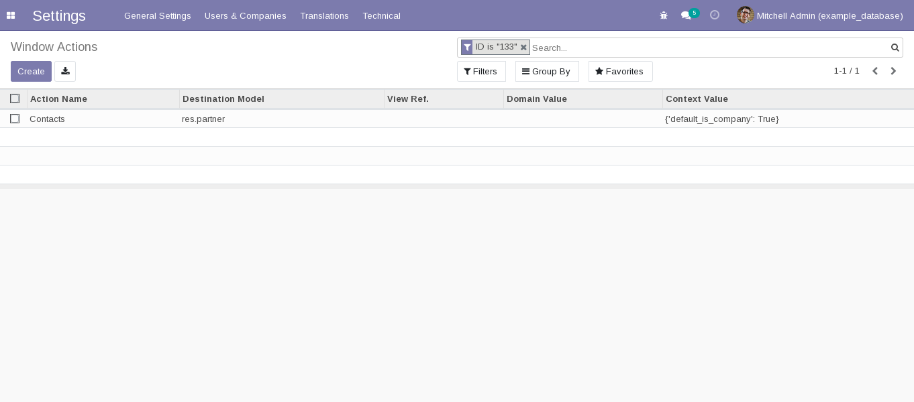
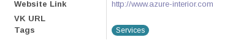

===============
 Первый модуль
===============

В данном разделе планируется создать первый модуль для Odoo,
а также затронуть некоторые сущности, которые встречаются на практике при написании модулей.

Задача
======

В форме партнера под поле "Website Link" добавить поле "Профиль VK", в котором будет содержаться ссылка на профиль партнера в ВКонтакте.

Решение
=======

Что такое партнер?
------------------

Под партнером в рамках данной задачи является моделью ``res.partner``.
На терминологии ООП моделью в Odoo называют еще классами.

У модели "Партнер" есть несколько полей среди них:

- "Имя"
- "Тип" со значениями "Личность" (Individual) и "Компания" (Company)
- Электронная почта
- и т.п.

Без разворачивания Odoo записи (record) данной модели можно увидеть в демо сервере от самих производилей Odoo по адресу https://runbot.odoo.com.
На практике его обычно называют ранботом от слова runbot.
Делается это следующим образом.

- Заходим по адресу https://runbot.odoo.com
- Ищем строку с 14.0 и нажимаем на кнопку с белой стрелкой в синем фоне, слева от которого написано "odoo".

.. image:: images/row_14_runbot.png

- Нажимаем на "Sign in" наверху
- Вводим admin:admin или demo:demo
- Нажимаем на основное меню (слева сверху)
- В всплывшем меню нажимаем Contacts

Мы видим мини-карточки партнеров. Такое представление (view, вьюха) в odoo называется канбаном (kanban).

Если нажать на любую из них, то мы попадем в страницу записи соответвующего партнера.
Эта страница обычно называется карточка, а ее представление называется формой (form).

.. image:: images/res_partner_1.png

Справа мы можем видеть поле "Website Link".
Собственно задача состоит в том, что под нее добавить свое поле.

Поправка существующего функционала
----------------------------------

Для добавления полей надо создать модуль, который

1. в модель ``res.partner`` добавляет поле vk_url
2. в карточке будет это поле отображать под полем Website Link

Подготовка к разворачиванию
---------------------------

Перед тем, как начать писать какой-либо модуль или исправлять существующий модуль необходимо:

1. настроить Odoo, чтобы:

   - задать пути к этим модулям
   - при необходимости установить требуемые python-пакеты

2. эти настройки сохранить

В нашем случае не будет необходимости устанавливать python-пакеты.
Перейдем каталог для проектов под Odoo 14.0
На основе шаблона создаем проект helloworld

.. code-block:: sh

   cd /opt/odoo-projects/14.0/projects

Создаем проект helloworld на основе шаблона:

.. code-block:: sh

   ./scaffold helloworld

Дальше мы создаем каталог, в котором планируем размещать свои модули.

.. code-block:: sh

   cd helloworld
   mkdir src

Поясняем, что проект в техническом смысле состоит из двух частей:

1. среда на котором этот проект запускаться.
   Запускаться проект будет в docker контейнерах, настройки контейнера указаны в ``docker-compose.yml``.
   Образ контейнера задается с помощью файла ``Dockerfile``.
   За основной образ берется образ, который разворачивали в предыдущей главе ``Настройка окружения для работы``

2. собственно сами модули

Теперь нам необходимо указать путь к нашим модулям.
Редактируем odoo.conf следующим образом:

.. code-block:: diff

   diff --git a/odoo.conf b/odoo.conf
   index 11ac9d7..79c0c3f 100644
   --- a/odoo.conf
   +++ b/odoo.conf
   @@ -1,5 +1,6 @@
    [options]
    addons_path =
   +            /mnt/project/src,
                /mnt/common/odoo/odoo/addons
    data_dir = /var/lib/odoo
    ; admin_passwd = admin

Поясняем, что внутри контейнера:

- текущий каталог с проектом ``/opt/odoo-projects/14.0/projects/helloworld`` соотвествует каталогу ``/mnt/project``

- каталог с клонированными репозиториями ``/opt/odoo-projects/14.0/common`` соотвестувет каталогу ``/mnt/common``

Настройка проекта в PyCharm
---------------------------

В PyCharm нажимаем на New Project.
Выставляем следующие опции:

- Location /opt/odoo-projects/14.0/projects/helloworld
- Python Interpreter: Previously configured interpreter
- Create a main.py welcome script: галочку убираем

Далее не торопимся нажимать на Create, а выбираем интерпретатор:

- Нажимаем на кнопку "..." рядом с полем Interpreter
- Во вкладке "Virtualenv Environment" нажимаем на кнопку "..." рядом с полем Interpreter
- Выбираем /opt/odoo-projects/14.0/venv/bin/python
- Проставляем галочку на "Make available to all projects"
- Нажимаем OK.

Вот теперь можно нажимать на Create

Написание модуля (TODO: переделать название раздела)
----------------------------------------------------

Перейдем в каталог, где будем писать модуль helloworld

.. code-block:: sh

   cd /opt/odoo-projects/14.0/projects/helloworld/src

И с помощью шаблонизатора создадим свой модуль

.. code-block:: sh

   mb addon

Если не используем обертку ``mb`` то создаем модуль следующим образом:

.. code-block:: sh

   mrbob bobtemplates.itpp.odoo:addon --remember-answers

Там спросят несколько вопросов.
На следующие вопросы отвечаем вот так:

- Odoo Version: 14
- Addon technical-category : misc
- "depends" in manifest: (без ответа)
- Addon technical name: helloworld

Поясие про некоторые ответы:

- Про technical category.
  К шаблонизатору заготоволены несколько иконок, которые соотвествуют введенному technical-category.

- Про technical name.
  Соотвествует имени каталога с модулем.

После чего будет создан каталог с модулем ``helloworld`` и скрытый файл ``.mrbob.ini``.
Если Вы пользуетесь оберткой ``mb``, то необходимо ``.mrbob.ini`` переименовать в ``helloworld.mrbob.ini``.

Далее переходим в каталог с модулем ``helloworld``.

.. code-block:: sh

   cd helloworld

В этом каталоге присутствуют как-минимум следующие фaйлы:

- ``LICENSE`` - файл с лицензией
- ``__init__.py`` - присутсвие данного файла позволяет использовать содержимое каталога, как python-овский пакет. Подробнее: https://docs.python.org/3/tutorial/modules.html#packages
- ``__manifest__.py`` - файл для определения модуля для Odoo. Подробнее: https://www.odoo.com/documentation/14.0/reference/module.html#manifest

Далее мы должны добавить в модель ``res.partner`` тектовое поле ``vk_url``.

.. code-block:: sh

   mb model

Если не используем обертку ``mb`` то:

.. code-block:: sh

   mrbob bobtemplates.itpp.odoo:model --config ../helloworld.mrbob.ini

На следующие вопросы отвечаем вот так:

- Inherit?: y
- Name of model or inheritance: res.partner
- Model description: (пусто)
- Add security?: n

После чего происходят следующие изменения:

- Создается каталог ``helloworld/models`` с файлами ``res_partner.py`` и ``__init__.py``.
  Внутри данного ``helloworld/models/__init__.py`` пишется ``from . import res_partner``.
- В ``helloworld/__init__.py`` записывается ``from . import models``

Перечисленные выше изменения необходимы для добавления своей модели или наследования существующих моделей.

Далее открываем ``helloworld/models/res_partner.py`` и пишем следующее:

.. code-block:: python

   from odoo import fields, models

   class ResPartner(models.Model):
       _inherit = "res.partner"

       vk_url = fields.Char("VK URL")

Тут мы добавляем в модель ``res.partner`` текстовое поле ``vk_url``. Тут перечисленые какие еще можно задать поля: https://www.odoo.com/documentation/14.0/reference/orm.html#fields

Теперь это поле необходимо показывать пользователю.
Для того, чтобы показать пользователю, надо выяснить, где показывать.
Мы должны найти вьюху с формой партнера.
А чтобы найти вьюху с формой партнера, надо найти action, которые отображает эту вьюху.

Поиск вьюхи
-----------

И так, запускаем Odoo.

.. code-block:: sh

   cd /opt/odoo-projects/14.0/projects/helloworld
   docker-compose up odoo

Поскольку мы в первый раз запускаем, то будет установка всех модулей с нуля.
Это занимает большое время и требуется подождать.
Когда в конце мы увидим эти строки, то можно считать что можно приступать к работе:

::

   odoo_1              | 2021-04-26 11:33:55,581 1 INFO example_database odoo.modules.loading: 20 modules loaded in 34.69s, 10215 queries (+0 extra)
   odoo_1              | 2021-04-26 11:33:56,049 1 INFO example_database odoo.modules.loading: Modules loaded.

Заходим в браузере http://odoo.localhost:14000
Скорее всего будет перенаправление в страницу входа.
В таком случае вводим admin:admin.

Поскольку мы разразработчики, поэтому надо включить режим разработчика.
Делается это можно двумя способами.

Первый способ простой для разработчиков.
Перейти по адресу ``/web?debug=1``.
То что после символа решетки можно оставить.

Второй способ простой для большинства клиентов.

- Основное меню -> Settings
- Прокручиваем в самый вниз
- Activate the developer mode

Далее нам нужно установить модуль контактов.
Заходим на основное меню -> Apps.
Справа будет строка поиска модулей.
К уже выставленному фильтру "Apps" добавьте "Contacts" и жмите Enter.
В результате увидите одну мини-карточку с приложением "Contacts".
Нажимаем на "Install" и ждем когда установится приложение "Contacts"

После перезагрузки страницы зайдите в основное меню -> Contacts и выбираем любой контакт.

Обращаем внимание на адресную строку, выглядит примерно вот так:

::

   http://odoo.localhost:14000/web?debug=1#id=14&action=133&model=res.partner&view_type=form&cids=&menu_id=95

Обращаем внимание на перечисление параметров после знака "решетка" (``#``):

- ``model=res.partner`` - очевидно, какая модель
- ``id=14`` - идетификатор записи этой модели
- ``action=133`` - идентификатор действия (action). В данном случае это действия - показ представления (view) модели res.partner.
- ``view_type=form`` - параметр, какое представление использовать

Напомню, что наша задача - найти представление, а чтобы найти его,  надо найти действие, которое вызывает это представление.
И так в нашем случае имеем идентификатор действия ``133``.
В Вашем случае будет иметь другое значения, но для примера будет ``133``.

Перейдем в основное меню -> Settings -> Technical -> Window Actions.
Под строкой поиска есть кнопка "Filters" со значком фильтра.
С помощью нее добавляем свой фильтр "ID is 133".

После применения фильтра мы в списке увидим то самое действие, которое нам нужно:

Нажимаем на нее и попадаем в форму этого действия.
У этой формы внизу есть раздел с таблицей Views.
В этой таблице для пары "View Type - View" есть значения "Form - res.partner.form".
Нажимаем на эту строку таблицы, далее во всплывшем окне нажимаем на "res.partner.form" и мы наконец-то попадаем на вьюху, которую нам надо редактировать.

Редактирование вьюхи
--------------------

Вообще говоря вьюху можно прямо в этой форме.
Но у того подхода есть сложность переноса изменений другому клиенту.
Клиенту удобно скинуть модуль, который редактирует форму, как нужно.

В самом модуле надо эти изменения описать.
Вернемся в форму этой вьюхи и смотрим на значение "External ID", который равен ``base.view_partner_form``.
Надо ее запомнить.

Итак возвращаемся в наш модуль helloworld

.. code-block:: sh

   cd /opt/odoo-projects/14.0/projects/helloworld/src/helloworld

и с помощью шаблонизатора создаем файл, в котором будем описывать изменения

.. code-block:: sh

   mb view

На предложенные вопросы отвечаем так:

- View name (underscored notation): res_partner_views

После этого шаблонизатор:

- создаст файл ``views/res_partner_views.xml``, в котором будем описывать изменения
- в файл ``__manifest__.py`` в раздел ``data`` добавит пусть к файлу из пункта выше

Откроем файл ``views/res_partner_views.xml`` и пишем следующее:

.. code-block:: xml

   <?xml version="1.0" encoding="UTF-8"?>
   <odoo>
       <record id="res_partner_form" model="ir.ui.view">
           <field name="name">res.partner.form.helloworld</field>
           <field name="model">res.partner</field>
           <field name="inherit_id" ref="base.view_partner_form" />
           <field name="arch" type="xml">
               <xpath expr="//field[@name='website']" position="after">
                   <field name="vk_url" widget="url" />
               </xpath>
           </field>
       </record>
   </odoo>

Пояснения по каждой строке элемента ``record``.

.. code-block:: xml

   <record id="res_partner_form" model="ir.ui.view">

Создается запись модели ``ir.ui.view`` (т.е. вьюха).
В свойстве ``id`` указан ``res_partner_form``, соотвественно внешний идентификатор этой записи будет ``helloworld.res_partner_form``.
Свойству ``id`` можно задать другое непустое значение, но главное чтобы в рамках модуля ``helloworld`` не было других записей с таким-же значением ``id``.

.. code-block:: xml

   <field name="name">res.partner.form.helloworld</field>

Тут задается имя этой вьюхи.
По сути взяли старое имя ``res.partner.form`` и приписали в конце ``.helloworld``.
Можнл задать другое непустое значение.

.. code-block:: xml

   <field name="model">res.partner</field>

Тут задается модель, к которой эта вьюха применяется

.. code-block:: xml

   <field name="inherit_id" ref="base.view_partner_form" />

Тут задается, какую вьюху поправляем.
Обращаем внимание на значение ``base.view_partner_form``.
Это внешний идентификатор вьюхи, которую мы упоминали выше.

.. code-block:: xml

   <field name="arch" type="xml">

Тут вводится сама вьюха или как ее менять.

.. code-block:: xml

   <xpath expr="//field[@name='website']" position="after">
       <field name="vk_url" widget="url" />
   </xpath>

Тут делается следующие операции:

- найти элемент ``field`` к которого свойство ``name`` равен ``website``.
- после этого элемента (``position=after``) вставить код ``<field name="vk_url" widget="url" />``

Мы вставляем поле ``vk_url`` и с помощью ``widget=url`` сделали так, чтобы это поле отображалась как ссылка.
Без ``widget=url`` это поле будет отображаться, как обычное текстовое поле.

Готово.
Теперь надо модуль установить.

- заходим в основное меню - Apps
- снимаем фильтр ``Apps``
- вводим ``helloworld``
- в появившемся мини-карточке нажимаем "Install".

После того, как модуль установится, заходим в основное меню - Contacts, выбираем любой контакт и видим, что мы добавили это поле.

