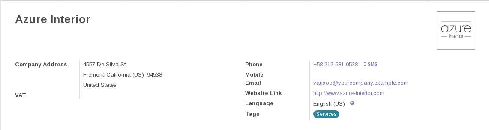

===============
 Первый модуль
===============

В данном разделе планируется создать первый модуль для Odoo,
а также затронуть некоторые сущности, которые встречаются на практике при написании модулей.

Задача
======

В форме партнера под поле "Website Link" добавить поле "Профиль VK", в котором будет содержаться ссылка на профиль партнера в ВКонтакте.

Решение
=======

Что такое партнер?
------------------

Под партнером в рамках данной задачи является моделью ``res.partner``.
На терминологии ООП моделью в Odoo называют еще классами.

У модели "Партнер" есть несколько полей среди них:

- "Имя"
- "Тип" со значениями "Личность" (Individual) и "Компания" (Company)
- Электронная почта
- и т.п.

Без разворачивания Odoo записи (record) данной модели можно увидеть в демо сервере от самих производилей Odoo по адресу https://runbot.odoo.com.
На практике его обычно называют ранботом от слова runbot.
Делается это следующим образом.

- Заходим по адресу https://runbot.odoo.com
- Ищем строку с 14.0 и нажимаем на кнопку с белой стрелкой в синем фоне, слева от которого написано "odoo".

.. image:: images/row_14_runbot.png

- Нажимаем на "Sign in" наверху
- Вводим admin:admin или demo:demo
- Нажимаем на основное меню (слева сверху)
- В всплывшем меню нажимаем Contacts

Мы видим мини-карточки партнеров. Такое представление (view, вьюха) в odoo называется канбаном (kanban).

Если нажать на любую из них, то мы попадем в страницу записи соответвующего партнера.
Эта страница обычно называется карточка, а ее представление называется формой (form).

Справа мы можем видеть поле "Website Link".
Собственно задача состоит в том, что под нее добавить свое поле.

Поправка существующего функционала
----------------------------------

Для добавления полей надо создать модуль, который

1. в модель ``res.partner`` добавляет поле vk_url
2. в карточке будет это поле отображать под полем Website Link

Подготовка к разворачиванию
---------------------------

Перед тем, как начать писать какой-либо модуль или исправлять существующий модуль необходимо:

1. настроить Odoo, чтобы:

   - задать пути к этим модулям
   - при необходимости установить требуемые python-пакеты

2. эти настройки сохранить

В нашем случае не будет необходимости устанавливать python-пакеты.
Перейдем каталог, где мы разворачивали Odoo и посмотрим в какой ветке мы находимся:

.. code-block:: sh

   cd /opt/docker-odoo-14
   git branch --show-current

Предполагается, что на выходе будет 14.0.
Если это не так, то надо сначала перейти в эту ветку:

.. code-block:: sh

   git checkout 14.0

После чего мы из этой ветки создаем свою ветку.
Допустим это будет 14.0-helloworld.

.. code-block:: sh

   git checkout -b 14.0-helloworld

Тут должен появится вопрос, зачем мы другую ветку создаем?
Ответ таков: мы создаем ветку, в котором будем хранить настройки для проекта.
На практике предполагается, что для каждого клиента будем создавать отдельную ветку со своими настройками.

Дальше мы настраиваем создаем каталог, в котором планируем размещать свои модули.

.. code-block:: sh

   mkdir vendor/me

Напомню, что слово vendor с английского переводится, как поставщик, а слово me - я.
В данном конктесте подразумевается, в каталоге ``vendor/me`` будут храняться модули, у которых поставщиком являюсь я.

Перейдем в этот каталог:

.. code-block:: sh

   cd vendor/me

И с помощью шаблонизатора создадим свой модуль

.. code-block:: sh

   mb addon

Если не используем обертку ``mb`` то создаем модуль следующим образом:

.. code-block:: sh

   mrbob bobtemplates.itpp.odoo:addon --remember-answers

Там спросят несколько вопросов.
На следующие вопросы отвечаем вот так:

- Odoo Version: 14
- Addon technical-category : misc
- "depends" in manifest: (без ответа)
- Addon technical name: helloworld

Поясие про некоторые ответы:

- Про technical category.
  К шаблонизатору заготоволены несколько иконок, которые соотвествуют введенному technical-category.

- Про technical name.
  Соотвествует имени каталога с модулем.

После чего будет создан каталог с модулем ``helloworld`` и скрытый файл ``.mrbob.ini``.
Если Вы польщуетесь оберткой ``mb``, то необходимо ``.mrbob.ini`` переименовать в ``helloworld.mrbob.ini``.
