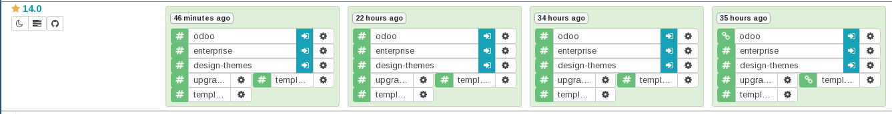

===============
 Первый модуль
===============

В данном разделе планируется создать первый модуль для Odoo,
а также затронуть некоторые сущности, которые встречаются на практике при написании модулей.

Задача
======

В форме партнера добавить поле "Профиль VK", в котором будет содержаться ссылка на профиль партнера в ВКонтакте.

Решение
=======

Что такое партнер?
------------------

Под партнером в рамках данной задачи является моделью ``res.partner``.
На терминологии ООП моделью в Odoo называют еще классами.

У модели "Партнер" есть несколько полей среди них:

- "Имя"
- "Тип" со значениями "Личность" (Individual) и "Компания" (Company)
- Электронная почта
- и т.п.

Без разворачивания Odoo записи (record) данной модели можно увидеть в демо сервере от самих производилей Odoo по адресу https://runbot.odoo.com.
На практике его обычно называют ранботом от слова runbot.
Делается это следующим образом.

- Заходим по адресу https://runbot.odoo.com
- Ищем строку с 14.0 и нажимаем на кнопку с белой стрелкой в синем фоне, слева от которого написано "odoo".

- Нажимаем на "Sign in" наверху
- Вводим admin:admin или demo:demo
- Нажимаем на основное меню (слева сверху)
- В всплывшем меню нажимаем Contacts

Мы видим мини-карточки партнеров. В odoo это называется канбаном (kanban).
